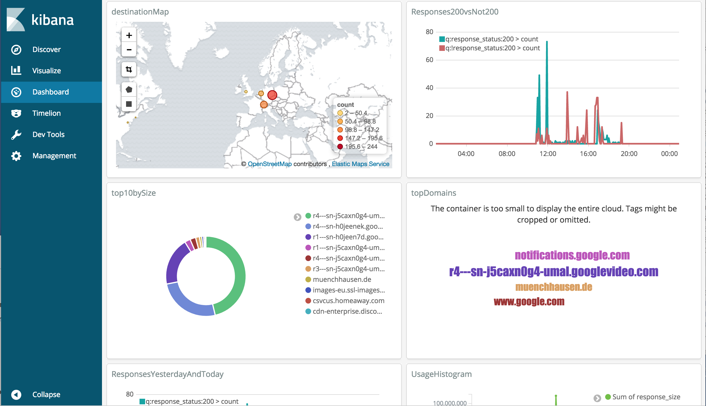

## Introduction

this image is an [squidGuard](http://www.squidguard.org/) addition to [sameersbn/docker-squid](https://github.com/sameersbn/docker-squid). I find squidGuard very useful to limit access to certain internet pages and to reduce the risk for downloading dangerous software. A central filtering solution is preferred especially if you have a family with children and different devices.

**new: You can run this container with own white- and blacklists or with public available lists from an external source.** Recommended blacklists are provided by [shallalist](http://www.shallalist.de/) - with some license restrictions especially for commercial use.

**new: You can combine this Container extremely simple with [sebp/elk](https://hub.docker.com/r/sebp/elk/). Just follow the instructions in [muenchhausen/docker-squidguard-elk](https://github.com/muenchhausen/docker-squidguard-elk)!

 

## Sample 1: black- and whitelists from [shallalist](http://www.shallalist.de/) 

create a docker-compose.yml file
```
squidguard:
  image: muenchhausen/docker-squidguard:latest
  environment:
    - UPDATE_BLACKLIST_URL=http://www.shallalist.de/Downloads/shallalist.tar.gz
  ports:
    - "3128:3128"
    - "80:80"
  expose:
    - 3128
    - 80
```
Setting the env Variable UPDATE_BLACKLIST_URL, the configuration in folder [sample-config-blacklist](https://github.com/muenchhausen/docker-squidguard/blob/master/sample-config-blacklist) will be used. Otherwise the [sample-config-simple](https://github.com/muenchhausen/docker-squidguard/blob/master/sample-config-simple) is used. In practice you need to configure your own black- and whitelists - see the next sample.

## Sample 2: own whitelists

create a docker-compose.yml file:
```
squidguard:
  image: muenchhausen/docker-squidguard:latest
  environment:
    - SQUID_CONFIG_SOURCE=/custom-config
    - SQUID_UID=1000          # only required if MAC OS is used: UserID for user proxy
  ports:
    - "3128:3128"
    - "80:80"
  expose:
    - 3128
    - 80
  volumes:
    - /Users/derk/myconfig:/custom-config     # please set here your PATH to your config folder!
```
See this [docker-compose.yml](https://github.com/muenchhausen/docker-squidguard/blob/master/docker-compose.yml) file for all possible settings.

create a ```squidGuard.conf``` file in your local myconfig directory
```
dbhome /var/lib/squidguard/db
logdir /var/log/squidguard

dest mywhite {
        domainlist      /custom-config/whiteDomains
        urllist         /custom-config/whiteUrls
}

acl {
        default {
                pass    mywhite	none
                redirect http://localhost/block.html
                }
}
```

create a ```whiteDomains``` file in your local myconfig directory
```
debian.org
wikipedia.org
muenchhausen.de
```

create a ```whiteUrls``` file in your local myconfig directory
```
github.com/muenchhausen/
```

## Run and Test it! 

* enter the directory where your docker-compose.yml file is located and run simply
```
docker-compose stop && docker-compose rm -f && docker-compose build && docker-compose up --force-recreate
```

* open a second bash, run e.g.:
```curl --proxy 192.168.99.100:3128 https://en.wikipedia.org/wiki/Main_Page```

* test a blocked domain from the adv blacklist. This is blocked if UPDATE_BLACKLIST_URL is used:
```curl --proxy 192.168.99.100:3128 http://www.linkadd.de```

* test it in your Browser: Set docker host IP and port 3128 in your proxy settings or operating system proxy configuration.

* if you decided for the WPAD autoproxy variant, just do now a DHCP release and you get your proxy settings :)

## Additions

### Web Proxy Autodiscovery Protocol (WPAD)

This image includes also automatic proxy discovery based on [WPAD](https://en.wikipedia.org/wiki/Web_Proxy_Autodiscovery_Protocol) and DHCP. The included Webserver serves wpad.dat.

add the following to your docker-compose.yml file 
```
squidguard:
  ...
  environment:
    - WPAD_IP=192.168.99.100
    - WPAD_NOPROXY_NET=192.168.0.0
    - WPAD_NOPROXY_MASK=255.255.0.0
```

To use WPAD, add a cusom-proxy-server option 252 to your DHCP server. Use "http://${WPAD_IP}/wpad.dat" e.g. "http://192.168.59.103/wpad.dat" as your option value. See [squidGuard Wiki](http://wiki.squid-cache.org/SquidFaq/ConfiguringBrowsers#Automatic_WPAD_with_DHCP) for further details.

You can add these settings also to your compose file - 

The default WPAD settings are the following:
```
function FindProxyForURL(url, host)
{
	if (isInNet(host, "{{WPAD_NOPROXY_NET}}", "{{WPAD_NOPROXY_MASK}}"))
		return "DIRECT";
	else
		return "PROXY {{WPAD_IP}}:3128";
}
```
You can put your custom wpad.dat file to your mapped config folder.

The standard message for a blocked page is 
```
This URL was blocked by your docker-squidguard!
```
You can modify this, if you place your custom block.html file to your mapped config folder.


### recommended documentation

For Squid basis configuration, please refer to the documentation of [sameersbn/docker-squid](https://github.com/sameersbn/docker-squid).

A simple documentation of how to configure squidGuard blacklists can be found in the [squidGuard configuration documentation](http://www.squidguard.org/Doc/configure.html).


### run it without docker-compose
it is of course possible to run the container also without docker-compose - e.g.:

```docker run --name='squidguard' -it --env UPDATE_BLACKLIST_URL=http://www.shallalist.de/Downloads/shallalist.tar.gz --env WPAD_IP=192.168.99.100 --env WPAD_NOPROXY_NET=192.168.99.0 --env WPAD_NOPROXY_MASK=255.255.255.0 --rm -p 3128:3128 -p 80:80 muenchhausen/docker-squidguard:latest```

### Shell Access

For debugging and maintenance purposes you may want access the containers shell. Either add after the run command or tun e.g.

```docker exec -it dockersquidguard_squidguard_1 bash```

### Autostart the container

add the parameter --restart=always to your docker run command.

